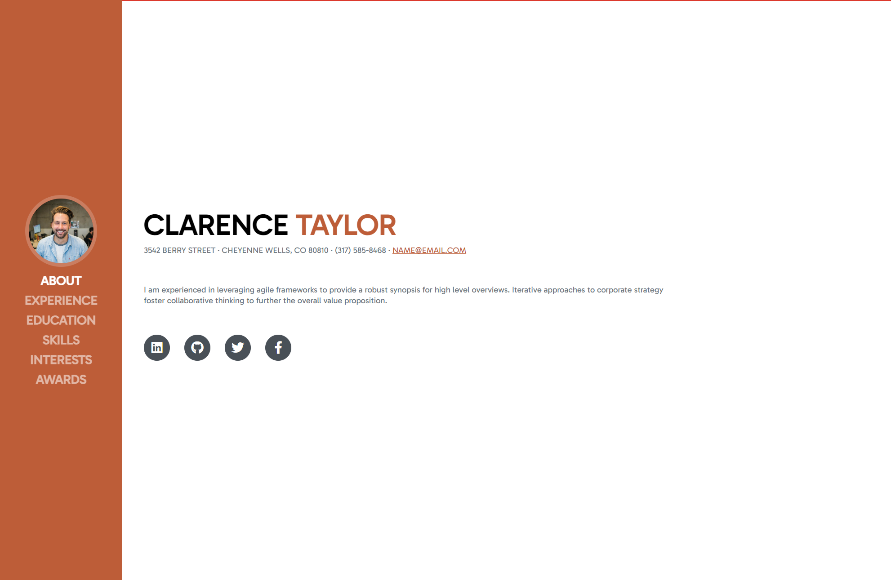
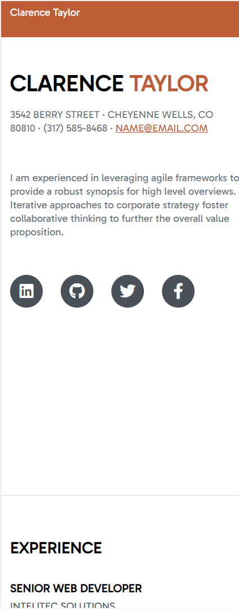

# Resume-Case



## Description

Resume-Case is a web-based platform for showcasing your resume in a visually appealing and interactive manner. This project aims to provide a modern and creative way to present your professional background to potential employers or anyone interested in your qualifications.

## Demo

You can check out the live demo of Resume-Case [here](https://kaadirm.github.io/Resume-Case/).

## Features

- **Interactive Design**: Resume-Case offers an engaging and interactive user experience, making your resume stand out.

- **Customizable**: Easily customize your resume by editing data files to include your personal information, education, work experience, and more.

- **Responsive**: The design is responsive, ensuring your resume looks great on both desktop and mobile devices.

## Getting Started

To get started with Resume-Case, follow these steps:

1. Clone the repository to your local machine:

   ```bash
   git clone https://github.com/Kaadirm/Resume-Case.git
